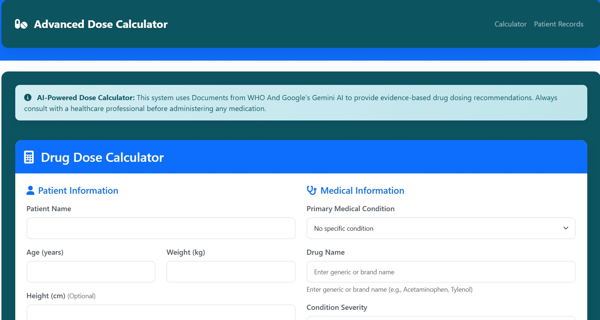

# AI-Powered Drug Dosage Calculator

AI-Powered Drug Dosage Calculator is a Flask web application with Google Gemini AI for advanced personalized drug dosage calculation leveraging AI and machine learning techniques.

## Overview

AI-Powered Drug Dosage Calculator aims to revolutionize personalized medication dosing by integrating cutting-edge technologies in AI, machine learning, and clinical decision support. This platform provides tools for automated analysis, prediction, and decision support in medication dosage calculation, particularly focusing on various drugs and patient demographics.

The system can calculate personalized drug dosages based on patient demographics (age, weight, height), medical conditions, severity levels, and allergies, providing comprehensive dosing recommendations with clinical guidelines and safety warnings.

## Features

* **AI-Powered Calculation**: Utilizes Google Gemini Pro API for intelligent dosage recommendations.
* **Patient Management**: Secure patient data management with comprehensive validation and error handling.
* **Drug Database**: Extensible database for multiple drugs, formulations, and medical conditions.
* **Safety Guidelines**: Built-in safety warnings, contraindications, and clinical best practices.
* **Administration Instructions**: Detailed instructions for drug administration routes and timing.
* **User-Friendly Interface**: Clean Bootstrap interface designed for ease of use by healthcare professionals.

## Installation

To run AI-Powered Drug Dosage Calculator locally, follow these steps:

1. Clone the repository:

```bash
git clone https://github.com/AbdelrahmanGamal236/AI-Powered-Drug-Dosage-Calculator.git
cd AI-Powered-Drug-Dosage-Calculator
```

2. Install dependencies:

```bash
pip install -r requirements.txt
```

3. Set up Google Gemini API key:

```bash
# Add your Google Gemini API key to environment variables
export GEMINI_API_KEY="your-api-key-here"
```

4. Run the application:

```bash
python app.py
```

5. Open your web browser and navigate to `http://localhost:5002` to access AI-Powered Drug Dosage Calculator.

## Usage

* **Enter Patient Information**: Input patient demographics including age, weight, height, and medical conditions.
* **Select Drug**: Choose the medication from available drug database.
* **Run Analysis**: The AI system analyzes patient data and medical history for personalized dosage calculation.
* **View Recommendations**: Review generated dosage recommendations, safety warnings, and administration guidelines.

## Contributing

Contributions are welcome! If you'd like to contribute to AI-Powered Drug Dosage Calculator, please follow these steps:

1. Fork the repository and create your branch from `main`.
2. Make your changes and ensure the code follows the project's coding standards.
3. Test your changes thoroughly with various patient scenarios.
4. Submit a pull request detailing your changes and their purpose.

## Contact

For inquiries about AI-Powered Drug Dosage Calculator and its models, please contact:

* **Email**: [Abdelrahman.Gamal.Ai@gmail.com](mailto:Abdelrahman.Gamal.Ai@gmail.com)
* **LinkedIn**: [linkedin.com/in/abdelrahman-gamal236](https://www.linkedin.com/in/abdelrahman-gamal236/)
* **WhatsApp**: +201029744194
* **GitHub**: [@AbdelrahmanGamal236](https://github.com/AbdelrahmanGamal236)
